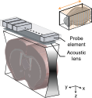

# fUSer

fUSer is a Python package for analyzing functional ultrasound (fUS) imaging data, 
including preprocessing, registration, and statistical analysis.
It supports direct loading and processing of raw scan data from Iconeus systems.

This is an early-stage release. APIs may change.

## Why a dedicated fUS library?

fMRI tooling (e.g., [nilearn](https://github.com/nilearn/nilearn)) is already mature and 
well-developed, so building a new library for fUS may initially seem like reinventing the wheel.
However, fUS data differ fundamentally in how they are acquired and structured, 
which means existing fMRI pipelines rely on implicit assumptions that 
do not strictly hold for fUS data and therefore require substantial adaptation.

*Source: [Brunner et al., Nature Protocols, 2021](https://doi.org/10.1038/s41596-021-00548-8), Fig. 3c*

fUS acquires one imaging plane at a time because ultrasound signals only encode depth 
along the beam direction, while lateral dimensions are reconstructed within a 2D slice.
There is no mechanism to encode the third spatial dimension in a single acquisition, 
so a 3D volume must be built by sweeping the probe.
In contrast, fMRI encodes spatial information directly in the signal using magnetic field gradients, 
allowing full 3D volumes to be acquired without mechanical motion.

In fMRI, data are naturally represented as a 4D array (time, x, y, z), 
where spatial and temporal dimensions are separable.
In fUS, however, data are acquired as (scan, pose, x, y, z).
In typical fUS acquisitions with a linear probe, y is 1, as each acquisition produces a 2D slice. 
This dimension is retained to support array-based probes where y > 1,
although it typically remains much smaller than the other spatial dimensions.
Time is given by the combination of (scan, pose), and space is given by (pose, x, y, z). 
The probe sweep dimension (pose) therefore couples space and time: 
each spatial slice is acquired at a different time point within a sweep. 
Treating these slices as if they were acquired simultaneously (e.g., by using scan as time) 
introduces a temporal misalignment, whose impact depends on the signal timescale and analysis type.
In timing-sensitive analyses (e.g., GLM, event alignment, latency estimation), this can lead to systematic bias.
As a result, fUS data are not strictly separable into independent time and space dimensions 
and cannot be represented as a standard 4D (time, x, y, z) array without approximation.

The figure illustrates probe pose as a function of time. 
Here, pose denotes the probe affine transform (a 4×4 matrix), 
typically dominated by translation but potentially including rotation. 
In this plot, pose is shown as a discrete index.
The red points and connecting lines indicate the probe trajectory over time. 
Note that pose indices are not necessarily spatially ordered.
In this example they follow a permuted sequence (e.g., 0 → 2 → 1 → 3), 
reflecting that probe positions may be sampled in a non-contiguous order.
Each repetition of this sequence corresponds to a scan, 
with repeated scans separated by the red dashed lines.

The black dots indicate missing time points for individual poses. 
These can be filled via per-pose interpolation (see `interpolate_pose`) 
to obtain a complete 4D representation.
However, interpolation introduces synthesized data and may affect downstream statistical analysis. 
For this reason, most components in this library are designed to 
operate directly on the original, non-uniformly sampled data.
